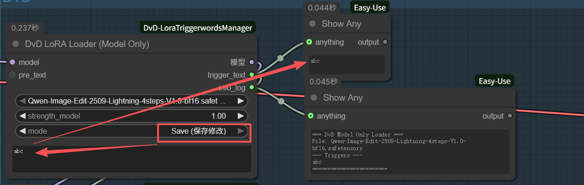
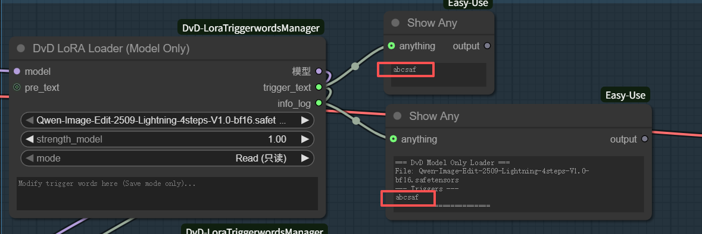
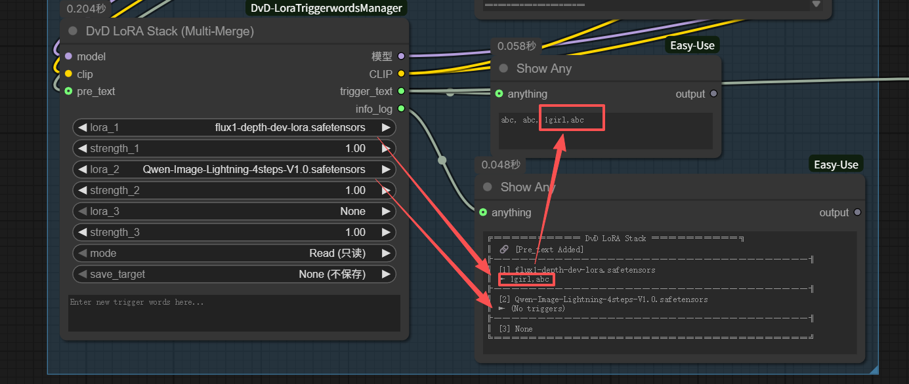
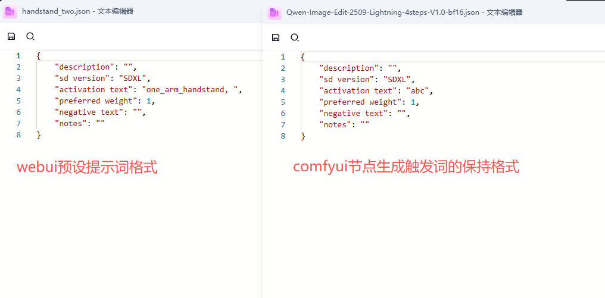
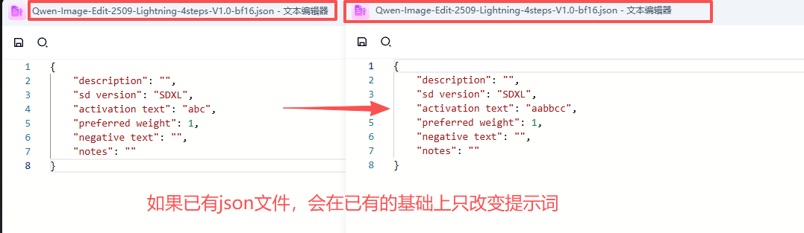

# ComfyUI-DvD-LoraTriggerwordsManager

A set of professional ComfyUI custom nodes designed to manage LoRA trigger words efficiently. 
Seamlessly read, edit, and save trigger words in **WebUI (Automatic1111) compatible JSON format**.

一款专业的 ComfyUI 自定义节点，用于高效管理 LoRA 触发词。
支持读取、编辑并保存 **WebUI (Automatic1111) 兼容的 JSON 格式** 触发词文件。

## ✨ Features (功能特性)

*   **Auto-Read Triggers**: Automatically reads `.json` or `.txt` metadata associated with your LoRA.
    *   自动读取与 LoRA 关联的元数据文件。
*   **WebUI Compatibility**: Saves edited trigger words in the standard format (`"activation text"`) used by Stable Diffusion WebUI.
    *   完美兼容 WebUI，保存格式为标准的 `"activation text"`。
*   **Chainable Workflow**: All nodes have a `pre_text` input, allowing you to chain multiple LoRA loaders together. The trigger words will be automatically concatenated with commas.
    *   支持“糖葫芦”式串联，触发词自动合并。
*   **Info Log**: Provides a clean, formatted log output for debugging or checking details.
    *   提供清晰的日志输出端口。
*   **Zero Dependencies**: Pure Python implementation, no complex JavaScript or extra pip installs required.
    *   零依赖，纯 Python 实现，无需安装额外库。

## 📦 Nodes (节点介绍)

### 1. DvD LoRA Loader (Trigger Words)
Standard LoRA loader with `MODEL` and `CLIP` connections.
*   **Inputs**: Model, Clip, LoRA Name, Strength.
*   **Mode**: `Read` (Default) or `Save`.
*   **Edit Text**: Input new trigger words here when in `Save` mode.
*   **Pre_text (Optional)**: Connect string from previous node to append.

### 2. DvD LoRA Loader (Model Only)
Optimized for FLUX/SD3 or workflows where you only need to modify the model weights without affecting CLIP directly (or handling CLIP separately).

### 3. DvD LoRA Stack (Multi-Merge)
Load 3 LoRAs at once.
*   **Merge Logic**: Automatically combines trigger words from all 3 LoRAs + `pre_text`.
*   **Save Target**: Select which LoRA (1, 2, or 3) to update when saving.

## 🚀 Installation (安装方法)

1.  Navigate to your ComfyUI custom nodes directory:
    (进入 ComfyUI 的 custom_nodes 目录)
    ```bash
    cd ComfyUI/custom_nodes/
    ```

2.  Clone this repository:
    (克隆本仓库)
    ```bash
    git clone https://github.com/idvdii/ComfyUI-DvD-LoraTriggerwordsManager.git
    ```

3.  Restart ComfyUI.
    (重启 ComfyUI)

## 🛠 Usage (使用说明)

### 1. Read Mode (读取模式)
Just select a LoRA. The node will automatically read the associated trigger words.
选择 LoRA 后，节点会自动读取关联的触发词。


### 2. Save Mode (保存/修改模式)
*   Change `mode` to **Save**.
*   Type your new tags in `edit_text`.
*   Queue a prompt (run once).
*   **Result:** The JSON file is updated/created instantly.
*   切换到 **Save** 模式，输入新触发词并运行一次即可保存。


### 3. Stack Mode (堆栈与合并)
Multiple LoRAs in one node. Trigger words are automatically concatenated. You can also specify which LoRA to update using `save_target`.
多重 LoRA 堆栈，自动合并触发词。可以通过 `save_target` 指定要修改哪一个 LoRA 的文件。


### 4. Compatibility (完美兼容 WebUI)
The generated JSON files use the standard format (`"activation text"`, etc.), ensuring full compatibility with Stable Diffusion WebUI.
生成的 JSON 文件采用 WebUI 标准格式，确保跨软件兼容。

| WebUI Format vs Plugin Format | Smart Update (Preserve Data) |
| :---: | :---: |
|  |  |
---

**License**: MIT


