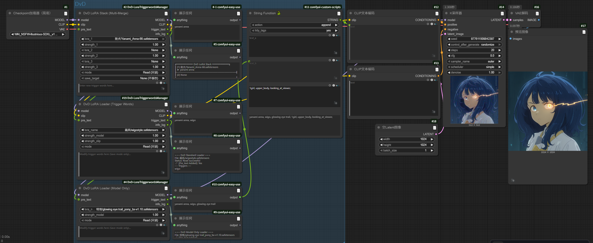
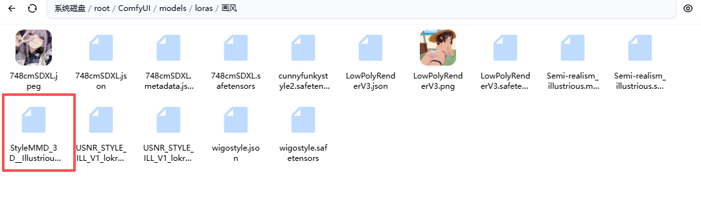
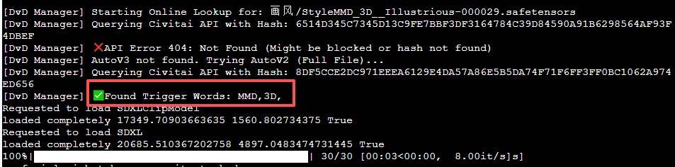
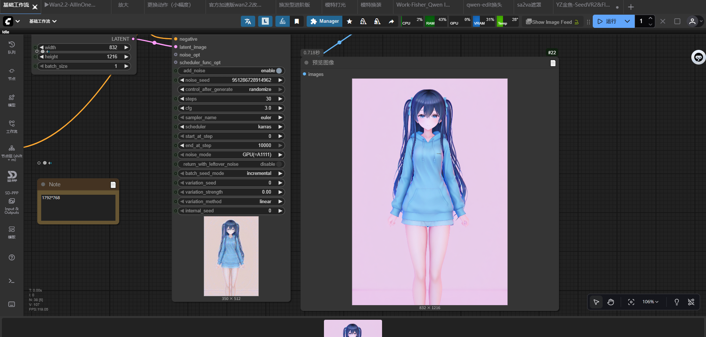
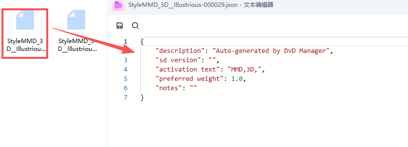

# ComfyUI-DvD-LoraTriggerwordsManager

[中文说明](README_CN.md)

A set of professional ComfyUI custom nodes designed to manage LoRA trigger words efficiently. 
Seamlessly read, edit, and save trigger words in **WebUI (Automatic1111) compatible JSON format**.

## ✨ Features

*   📖 **Auto-Read**: Automatically reads `.json` or `.txt` metadata associated with your LoRA from the same directory.
*   🌐 **Smart Lookup**: **(New!)** If no local metadata exists, it automatically calculates the model hash (AutoV3/V2), queries Civitai for trigger words, and generates a config file.
*   ✍️ **Read & Edit**: Not only reads tags but allows you to edit and save them directly within the node.
*   🔄 **WebUI Alignment**: Saves files strictly following the A1111 WebUI standard JSON format (e.g., `"activation text"`, `"sd version"`), ensuring full cross-software compatibility and data preservation.
*   🔗 **Auto-Merge**: Whether chaining single nodes or using a stack, all trigger words are automatically concatenated with commas. No need for extra text concatenation nodes.
*   🐍 **Pure Python**: Zero frontend dependencies, stable performance, and no complex installation steps.



## 📦 Nodes

### 1. DvD LoRA Loader (Trigger Words)
Standard LoRA loader with `MODEL` and `CLIP` connections.
*   **Inputs**: Model, Clip, LoRA Name, Strength.
*   **Mode**: `Read` (Default) or `Save`.
*   **Edit Text**: Input new trigger words here when in `Save` mode.
*   **Pre_text (Optional)**: Connect string from previous node to append.

### 2. DvD LoRA Loader (Model Only)
Optimized for FLUX/SD3 or workflows where you only need to modify the model weights without affecting CLIP directly (or handling CLIP separately).

### 3. DvD LoRA Stack (Multi-Merge)
Load 3 LoRAs at once.
*   **Merge Logic**: Automatically combines trigger words from all 3 LoRAs + `pre_text`.
*   **Save Target**: Select which LoRA (1, 2, or 3) to update when saving.

## 🚀 Installation

1.  Navigate to your ComfyUI custom nodes directory:
    ```bash
    cd ComfyUI/custom_nodes/
    ```

2.  Clone this repository:
    ```bash
    git clone https://github.com/idvdii/ComfyUI-DvD-LoraTriggerwordsManager.git
    ```

3.  Restart ComfyUI.

## 🛠 Usage

### 1. Read Mode
Just select a LoRA. The node will automatically read the associated trigger words.


### 2. Save Mode
*   Change `mode` to **Save**.
*   Type your new tags in `edit_text`.
*   Queue a prompt (run once).
*   **Result:** The JSON file is updated/created instantly.


### 3. Stack Mode
Multiple LoRAs in one node. Trigger words are automatically concatenated. You can also specify which LoRA to update using `save_target`.


### 4. Compatibility
The generated JSON files use the standard format (`"activation text"`, etc.), ensuring full compatibility with Stable Diffusion WebUI.

| WebUI Format vs Plugin Format | Smart Update (Preserve Data) |
| :---: | :---: |
|  |  |

### 5. Automatic Discovery
**Scenario:** You downloaded a "naked" LoRA (`.safetensors` only) and don't know the trigger words.

**1. The initial folder (No JSON):**


**2. Automatic Online Lookup:**
Just run the node. It calculates the hash, queries Civitai, and finds the correct tags (e.g. "MMD, 3D").


**3. Generation & Result:**
The tags are automatically injected into the prompt to generate the image.


**4. Permanent Saving:**
A standard `.json` file is **automatically created** with the correct format. You never need to look it up again!


---

**License**: MIT

